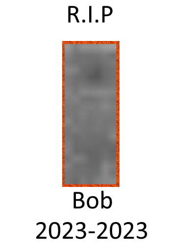
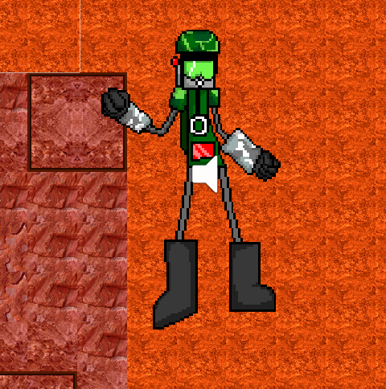

# Plaib's poopy Dev Log #2

---

```
August 17 2023
```

# Um...

So I may or may not have just remembered that this existed and uhhhhhh... I mean I uploaded the previous one so... Yeah alright, alot
has changed since May. 

# The changes

For the first time in the history of this game series, you can now shoot in 8 directions... SO CRAZY-


Okay actually, you can only shoot in 5 directions because of a bug but this should be fixed in the final release... scratch that, the first public demo. Yeah so i'm going to upload a public demo for the first stage so that should hopefully come out soon... Assuming i'm productive.


Also, the Bob enemy is gone... rest in piece Bob.



But we now have actual enemies, let me introduce you to the Grunt.



This will be one of the primary enemies you will encounter in the game so thats fun.


And I think thats about it for what I can show as of now.

# When do you suspect the public demo will come out?

Hopefully by the end of August or September. School is starting up so I can't do much unfortently. 

# Where will I find the public demo?

Probably will post it here and MAYBE itch.io??? Still trying to think of a good place to upload this.

# Thats a wrap

This pretty much wraps up the second dev log, lots of shit have happened and public demo should be a thing... Hopefully.