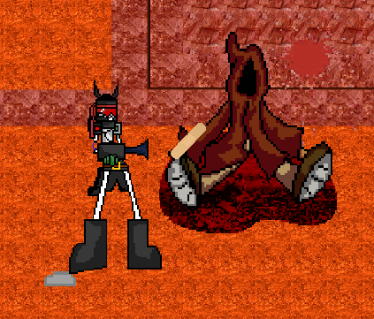
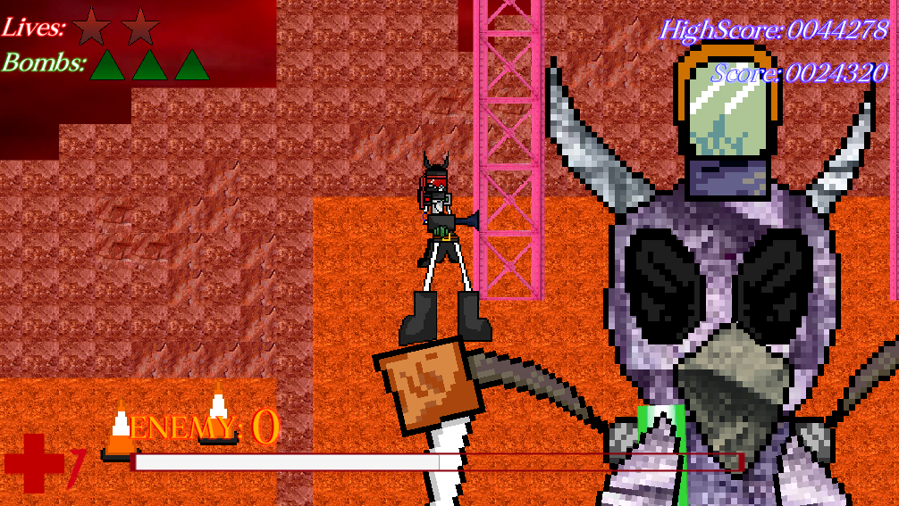
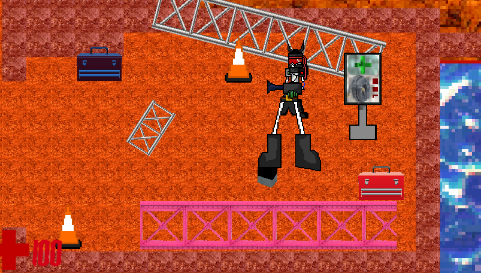
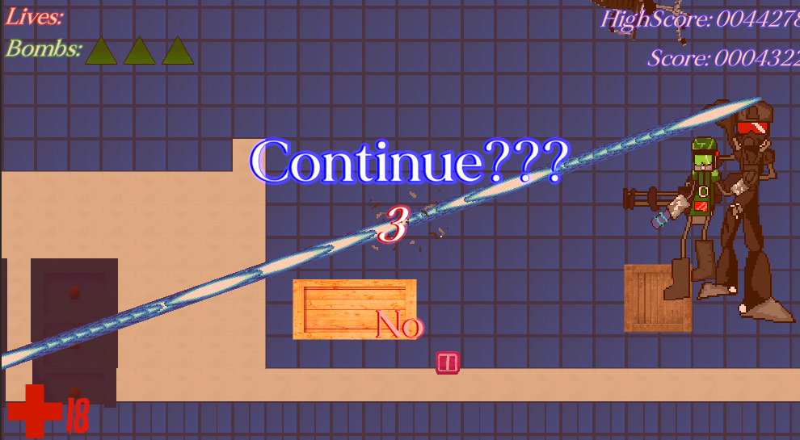
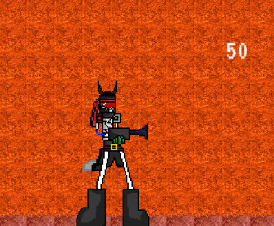
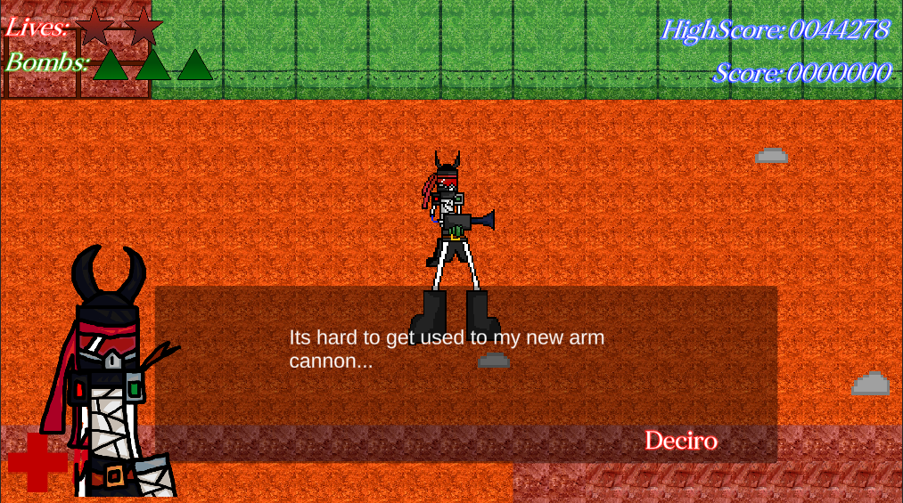
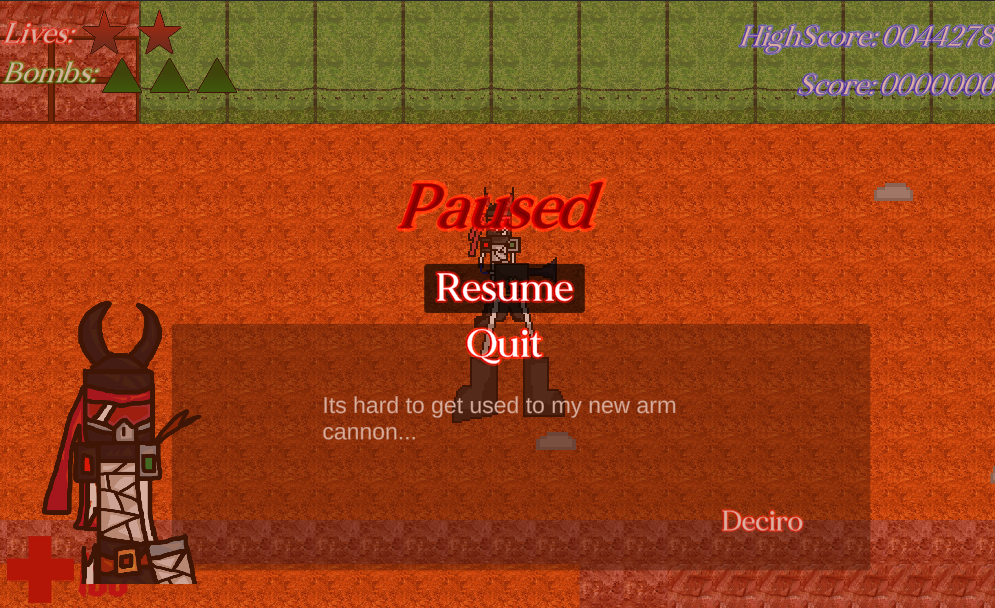

# Plaib's poopy Dev Log #4

---

```
August 7 2024
```

# I forgor x2

I forgot about this again excpet for a couple of months. I already explained in the Exordium trailer that the reason the update
took a long time was because of school stuff. Anyways, just a few days ago, a new update came out that added Deciro's stage 2.

# THE IMPROVEMENT UPDATE (real)

I'm calling V 1.3.4 the "Improvement" update due to the fact that the whole update is just me polishing up the game more. There isnt
a new stage or whatever, just me adding and improving upon everything.

# Adding more to stage 1

I have been adding more stuff to stage 1. Such as adding corspes to the stage and adding more detail to the "Crim" midboss arena.



There are now girders next to the machine to make it seem more like it was meant to be a construction zone. To further add on to that, the
next area that holds the Boss Button now has more detail. 





# Quality of life improvements

## Player damage

The player now has IFrames (invincibility frames) during the main game. Also, the player will now spew out blood (or oil) if you get hit
alongside having its own dedicated hit sound. You can also skip dialogue by holding down control.

## Bug fixes

Some bugs such as stage 2 having some broken colliders and Grim's (the minigun guy in stage 2) laser attack now not shooting every fucking
frame.

*Bug in question*



## Score

Score bonus's for each difficulty are now added, with Berzerk giving the most bonus points.

Each individual enemy also add more score, with the weaker enemies giving the least amount of score while more aggresive and
harder enemies give out more score. A score popup will appear upon the enemy dying. The death score will also increase depending on
difficulty (easy dosnt give any, normal gives the normal death score, hard multiplies it by 2, berzerk multiplies it by 4)



Mol Card bonus's and standard bullet hell bonus's now show up in the rest of the bullet hell bosses besides Deciro stage 1.

## Pausing



You can now no longer pause during dialogue and continue screens. The code was already there but apparently it didnt function so
I fixed it.



## Bosses

Alongside the rest of the bullet hell bosses having bonus's, they now have UI for when they activate their Mol Card (cuh). I also fixed
the Mol Card flash which, can't believe it took this long to fix.

# What now?

Idk, Ill release the update later or probably tmr. Hopefully there arent anymore bugs :000

