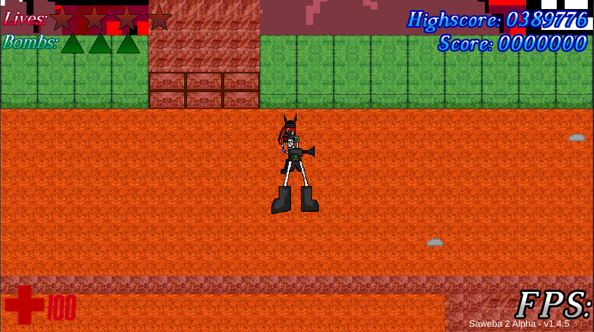
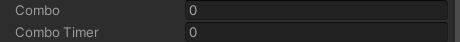
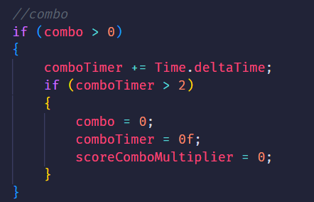
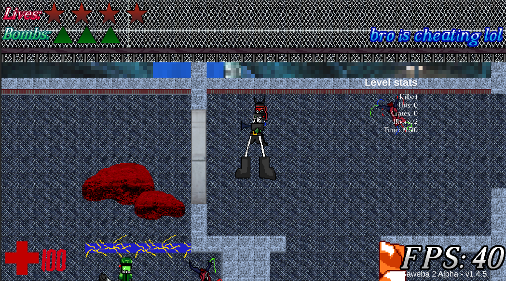

# Plaib's poopy Dev Log #5

---

```
May 1 2026
```

# 2 years...

Okay so... I'm not consistent with this bowl shit. I posted some updates back in 2025 via my [YouTube channel](https://www.youtube.com/watch?v=I2w9V8nqTZo), but I havent wrote any cool logs. Why? I forget and
I've been busy with college ( ;´ - `;)

Trust, I've been working on this still!

# NEW UI

I added a custom font using some public domain/royalty free font. I added some cool outline and gradient and now it looks cool.



As you can also see. I zoomed out the camera and now it looks better (hopefully)... Also the FPS works bro trust-

# Cool new Gameplay stuff

I have sped up both **Deciro** and **Lazo**, so now they walk way faster then before which should make gameplay gooder. I have also reduced the hitboxes so now even
during normal gameplay, they have small ass hitboxes so :D

## New combo system



There is a semi obscure combo system where after killing an enemy, the combo number increases and a timer increases. As you kill more enemies, the score amount increases
and you have to kill as much enemies as you can before the timer hits 2 and reverts back to 0, alongside your combo.

###### Below is the cool ass code



So that makes score running cool.

## P Rank bonus



These are some stats, get them maxed out before the PAR time and you get a P Rank bonus which gives you shit tons of score!


# Refinements

Mid bosses and bosses now drop items so thats very nice! Berzerk has been nerfed but at the same time buffed so look out!! Other stages are getting near completion and yeah,
shit is lit!!

